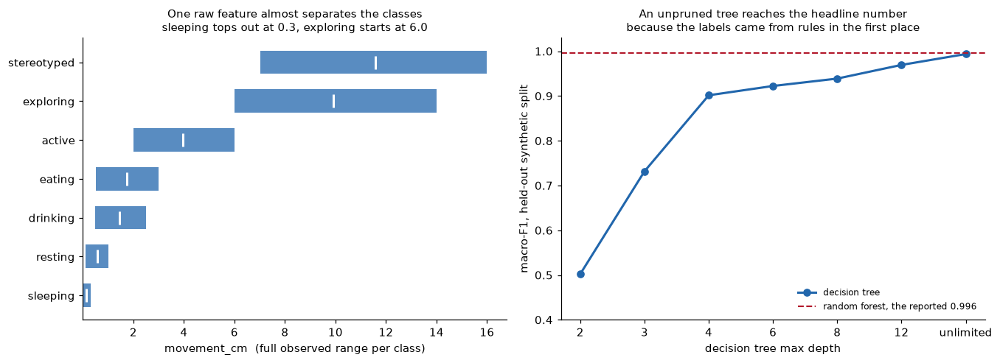
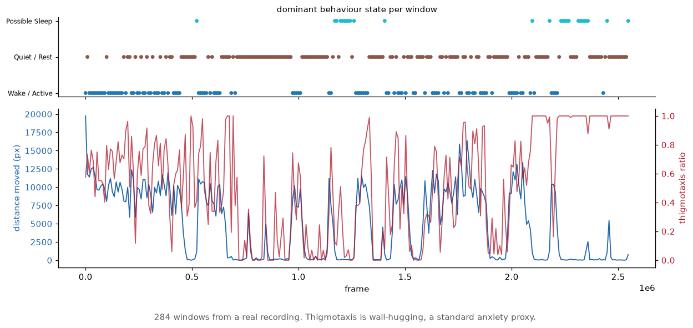
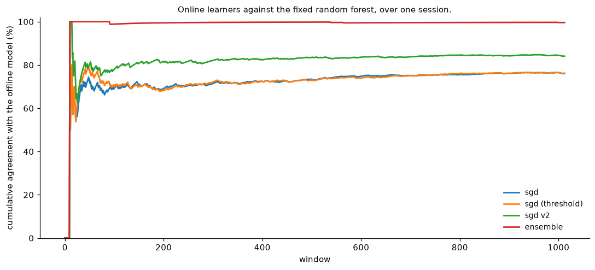
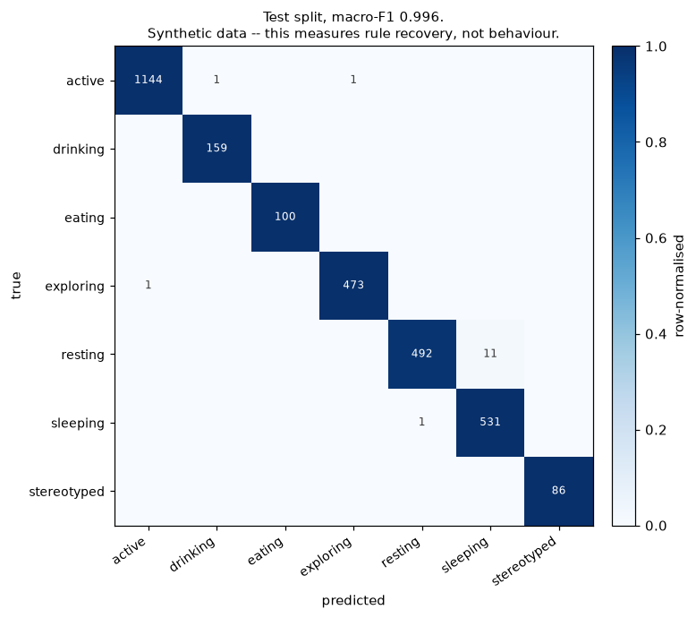

# Smart IVC cage, the software platform

A full software stack for an instrumented **individually ventilated cage (IVC)**
used in laboratory animal research: precision feeding, closed-loop water dosing,
load-cell mass sensing, metabolic gas analysis, camera monitoring and behaviour
classification, running on a Raspberry Pi 5 next to the cage, reachable from
anywhere, and redeploying itself within 60 seconds of a push.

Built as a third-year Industry Project at Howest University of Applied Sciences
for an external client in animal-research instrumentation.

> **This was a three-person team project, and this repository is a sanitised
> extract of it.** I contributed 173 of 204 commits and own the backend, the
> dashboard, the device/firmware layer and the deployment pipeline. The
> behaviour-classification models were principally the work of a teammate
> see [Attribution](#attribution). Client identifiers, meeting minutes, peer
> evaluations and production hostnames have been removed; nothing here is
> confidential.

---

## The number I am not going to advertise

The original report leads with **macro-F1 0.996** for the behaviour classifier.
That number is real, reproducible, and close to meaningless, and it is worth
explaining why, because it is the most instructive thing in the project. It and
every other measured figure below are recomputed from the raw metrics by
independent implementations in `verify/`, and CI fails the build if any of them
disagree.

The classifier is trained and tested on a **synthetic dataset** produced by
`ai/training/generate_dataset.py`, a hand-written generator that seeds labels
from a rule-based distribution (mice are nocturnal, eat in bouts, sleep during
the day). The model then learns to recover those rules. Testing on a held-out
split of the *same generator* measures how separable the generator made its own
classes, not whether the system can classify a real mouse.



Left: the generator writes each behaviour as its own band of`movement_cm`. Sleeping
never exceeds 0.3 cm, resting stops at 1.0, exploring starts at 6.0. Right: an
unpruned decision tree on those features reaches macro-F1 0.9936, which is the
reported random-forest number to within 0.003. The classifier is recovering the
rules the generator wrote, and nothing else.

Two independent signals say the task is close to trivial:

| model | macro-F1 (held-out synthetic) |
|---|---:|
| random forest | 0.996 |
| hist gradient boosting | 0.996 |
| logistic regression | 0.935 |

Two unrelated model families landing on the *identical* score, with a linear
model only six points behind, is what a saturated benchmark looks like. On a
genuinely hard tabular problem you would expect them to separate.

**No labelled real-animal data was ever collected**, because the cage hardware
and the ethical approval for live animals were outside the project's scope. So
the honest claim is narrow: *the inference path is built, integrated and running
end to end, and its accuracy on real behaviour is unmeasured.* The pipeline is
the deliverable; the score is not evidence.

I would rather state this than let a reader assume 0.996 means something it
doesn't, and it is the first thing I would fix given animals and an ethics
approval.

---

### Behaviour monitoring on real recordings



284 windows of camera output from the actual rig, which is the part of the AI
stack that is not synthetic. Thigmotaxis is wall-hugging, a standard anxiety proxy
in rodent work, and it is tracked alongside movement because either alone is
ambiguous.



The SGD variants update on the stream while the random forest stays fixed. What
matters operationally is whether the thing running on the Pi stays close to the
thing that was validated offline.



Included for completeness, and it should be read against the separability figure
above rather than on its own.

## The engineering I would actually point at

### Closed-loop volumetric water dosing
Delivering an *exact* volume of water to a mouse is harder than running a pump for N seconds, and getting it wrong corrupts the intake measurement the whole experiment depends on.

Full detail in [notes/METHODS.md](notes/METHODS.md#closed-loop-volumetric-water-dosing).
### A DHT11 driver written from the datasheet

The temperature/humidity sensor is driven by an inline-protocol implementation
in firmware rather than a library, the single-wire timing is handled directly
against the datasheet. Timing diagram in [`docs/HARDWARE.md`](docs/HARDWARE.md).

### Cameras that survive more than one viewer

The first camera implementation returned 503s as soon as two dashboard sessions
opened the same stream, each request tried to own the capture device. It now
runs a **persistent ffmpeg process per camera with a shared frame cache**, so
concurrent viewers read the same decoded frame instead of contending for
hardware.

### A deployment with no inbound ports

The Pi is reachable at a public HTTPS hostname through a **Cloudflare Tunnel**,
so there is **no port forwarding and no inbound port open on the lab network**: which matters when the device lives on a university network you do not control.
Deployment is **pull-only**: a systemd timer polls the repository and redeploys
within 60 seconds. The Pi never accepts a push and exposes no deploy endpoint,
so compromising the pipeline does not give you the device.

### Security posture

JWT bearer auth with bcrypt hashing and constant-time verification, a
rate-limited login endpoint, HSTS, per-path CSP,`X-Frame-Options: DENY`,
`X-Content-Type-Options: nosniff`, Referrer-Policy, Permissions-Policy, COOP and
CORP, plus an RFC 9116`security.txt`. CI runs`pip-audit` on every push.

---

## Architecture
```mermaid flowchart LR B["Browser<br/>PWA, 4 languages"] CF["Cloudflare Tunnel<br/>no inbound ports"] subgraph PI["Raspberry Pi 5 — tolerates jitter"] API["FastAPI + SQLite<br/>JWT, WebSocket fan-out"] UI["React 18 dashboard"] CAM["MJPEG camera service"] INF["Inference<br/>behaviour + MAD anomaly"] end subgraph MEGA["Arduino Mega 2560 — owns the real-time loop"] LC["3x HX711 load cells<br/>food / water / animal"] DHT["DHT11 · T and RH"] FLOW["YF-S401 flow sensor"] ACT["Food-gate servo<br/>pump + solenoid relays"] end GAS["O2 JXW-02 · USB<br/>CO2 MH-Z19C · UART"] B <-->|HTTPS / WSS| CF CF <--> API API --- UI API --- CAM API --- INF API <-->|USB serial| MEGA GAS --> API LC & DHT & FLOW --> ACT ``` The Mega owns anything with a deadline; the Pi owns anything that can wait.

Full detail in [notes/METHODS.md](notes/METHODS.md#architecture).
## Running it

```bash
cp .env.example .env      # then change every default password in it
docker compose up --build
```

The dashboard is at`http://localhost:5173`, the API at`http://localhost:8000`,
and OpenAPI docs at`/docs`. A **device simulator** ships with the stack, so the
whole platform runs end to end with no hardware attached, the simulator feeds
synthetic cages over the same ingest API the Mega uses.

Backend tests:

```bash
cd backend && pip install -r requirements.txt pytest && pytest
```

18 tests, covering auth, role enforcement, ingest round-trip and health.

> The default credentials in`.env.example` are placeholders (`change-me-please`).
> They are seeded only on first boot and must be changed before any real
> deployment.

---

## Limitations

- **The behaviour classifier has never seen a real mouse.** See above. Everything
  about the inference path is real; the accuracy figure is not transferable.
- **No live hardware in this repository.** The trained YOLO/tracking weights
  (~43 MB) are excluded, they are a teammate's artefacts and large. The
  behaviour model artefact is kept so the backend runs on a fresh clone, and the
  backend falls back to a deterministic rule-based classifier if it is missing.
- **Single-cage validation.** The data model and simulator support many cages,
  but only one physical cage was ever assembled, so multi-cage behaviour is
  untested against hardware.
- **SQLite.** Fine for one Pi and one cage; the write path would need Postgres
  before this scaled to a rack.

---

## Attribution
Commit counts from the original repository, which is the fairest evidence available: | contributor | commits | principal area | |---|---:|---| | **Aghasalim Mustafazada** (this account) | 173 | backend, dashboard, device/firmware, deployment, docs | | **Gražvydas Stalmokas** | 29 | behaviour-classification models, multi-animal tracking | | **Hadi Hleihel** | 2 |, | Concretely: I wrote the FastAPI backend and its tests, the React dashboard, the Arduino firmware and the Pi-side device services, the camera service, the Cloudflare Tunnel and pull-only deploy pipeline, and the documentation.

Full detail in [notes/METHODS.md](notes/METHODS.md#attribution).
## References

This is a platform rather than a method, so the list is short and the entries
are standards and tools the implementation follows, not results it reproduces.

- **Directive 2010/63/EU on the protection of animals used for scientific purposes.** [eur-lex.europa.eu/eli/dir/2010/63/oj](https://eur-lex.europa.eu/eli/dir/2010/63/oj) The regime any live-animal use would fall under. This project never ran on live animals and never obtained ethical approval, which is stated in the scope section and is the reason the behaviour accuracy here is unmeasured.
- **Leys, Ley, Klein, Bernard, Licata. Detecting outliers: Do not use standard deviation around the mean, use absolute deviation around the median. Journal of Experimental Social Psychology 49, 2013.** [doi:10.1016/j.jesp.2013.03.013](https://doi.org/10.1016/j.jesp.2013.03.013) The median absolute deviation rule used by the anomaly detector.
- **Component datasheets: HX711 load cell amplifier, DHT11 temperature and humidity sensor, MH-Z19C NDIR CO2 sensor, JXW-02 electrochemical O2 sensor.** The calibration constants and the sampling limits in the firmware come from these.

## Licence

MIT, see [LICENSE](LICENSE). Client identity, meeting minutes, peer evaluations,
production hostnames and default credentials have been removed from this extract.
