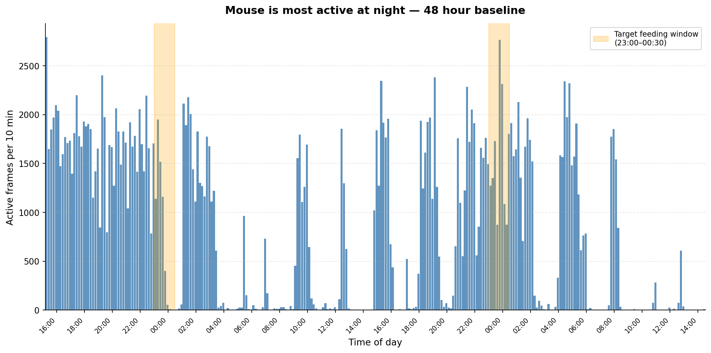
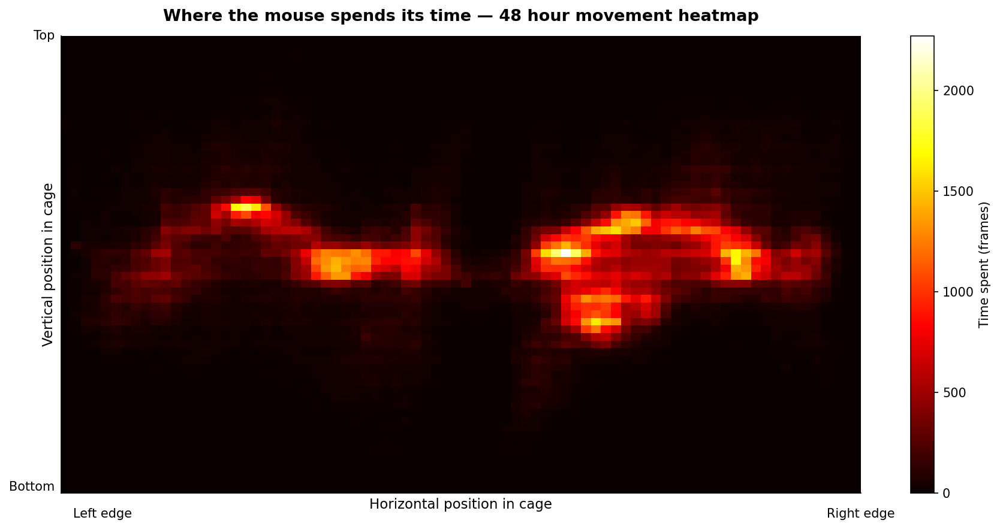
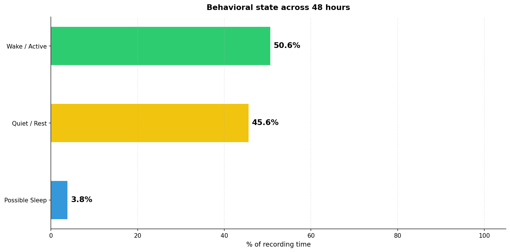
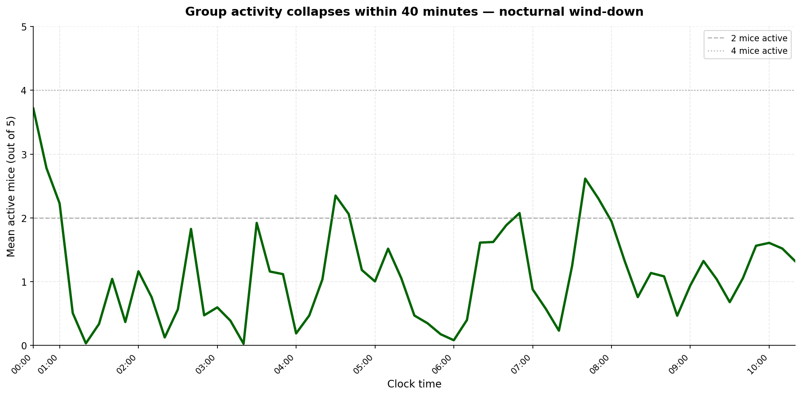
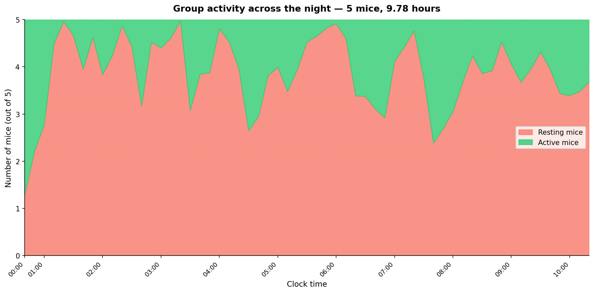
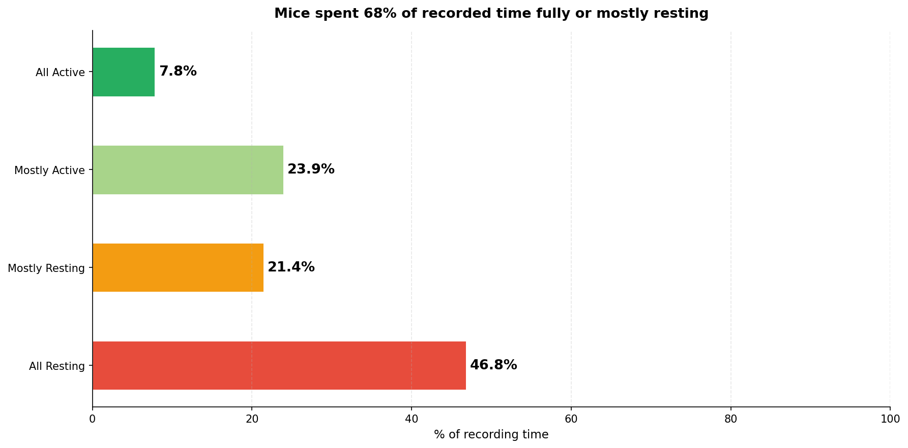

# ML, behaviour classifier

Predicts what a mouse is doing from one minute of sensor data.

## Output classes

| Label | When it fires |
| --- | --- |
|`sleeping` | grid mostly empty, very little movement, daytime hours |
|`resting` | low movement, awake |
|`active` | moderate movement across multiple cells |
|`exploring` | high movement, many cells visited |
|`eating` | feeding gate open AND animal near feeder |
|`drinking` | water flow detected AND animal near nozzle |
|`stereotyped` | high movement confined to a single cell (repetitive pacing) |

## Pipeline

1. **Generate** a synthetic dataset with`training/generate_dataset.py`
   (seeded RNG → fully reproducible).
2. **Train** the production model with`training/train.py`, it writes
`models/behaviour.pkl` plus a metrics report under`reports/`.
3. **Compare** models with`training/compare_models.py`, benchmarks
   LogReg, RandomForest, and HistGradientBoosting on the same held-out set.
4. The backend loads`models/behaviour.pkl` on boot; if it's missing,
   it falls back to a deterministic rule-based classifier so the platform
   still works.

## Quick start

```bash
cd ai
pip install -r requirements.txt
python training/generate_dataset.py
python training/train.py
python training/compare_models.py
```

After running, copy the model into the backend image:

```bash
mkdir -p ../backend/models
cp models/behaviour.pkl ../backend/models/behaviour.pkl
```

The Docker image bakes this in at build time.

---

## IVC Camera Pipeline

Real-time behavioral monitoring from the IVC cage camera feed.
Two independent modules, single-mouse (48h baseline) and group-level (5 mice).
Both use OpenCV motion detection; no pose estimation library required.

### Modules

| Module | Camera | Animals | Duration | Method |
| --- | --- | --- | --- | --- |
|`behavioral_monitoring` | Top-down infrared | 1 mouse | 48h | Frame-diff → RF classifier |
|`multi_animal_tracking` | Front-facing wide-angle | 5 mice | 9.78h | Frame-diff → contour count |

### Behavioral states (single mouse)

| Label | Definition |
| --- | --- |
|`Wake / Active` |`movement_smooth` ≥ 2.5 px/frame |
|`Quiet / Rest` | Low movement, not sustained |
|`Possible Sleep` | ≥ 30 s continuous inactivity |
|`Repetitive` | High movement confined to ≤ 10 px radius (stereotypy) |

### Group states (5 mice)

| Label | Active bodies |
| --- | --- |
|`All Active` | ≥ 4 |
|`Mostly Active` | 2 to 3 |
|`Mostly Resting` | 1 |
|`All Resting` | 0 |

### Quick start, camera pipeline

Install camera dependencies (separate from the synthetic-model requirements
due to version differences, see note below):

```bash
pip install -r requirements-camera.txt
```

**Single-mouse pipeline**: place`mouse_data.avi` in
`training/behavioral_monitoring/`, then:

```bash
python training/behavioral_monitoring/run_pipeline.py
```

Writes`data/behavioral_monitoring/outputs/` CSVs and
`reports/behavioral_monitoring/outputs/plots/` PNGs.

**Group pipeline**: place`multiple_mouse.mp4` in
`training/multi_animal_tracking/`, then:

```bash
python training/multi_animal_tracking/run_full_tracking.py
```

**Real-time monitor** (live camera feed, swap path in line 1):

```bash
python inference/behavioral_monitoring/realtime_monitor.py
```

**Train RF classifiers** (after single-mouse pipeline has run):

```bash
python training/behavioral_monitoring/train_classifier.py
```

Writes`models/behavioral_monitoring/outputs/state_classifier.pkl`.

> **Note on requirements:**`requirements-camera.txt` pins numpy 2.4.x and
> pandas 3.0.x, which differ from`requirements.txt` (numpy 1.26.x,
> pandas 2.2.x). Use a separate virtual environment for the camera pipeline
> until version compatibility is confirmed.

### Results

**Mouse is most active at night, 48 hour baseline**
(orange bands = target feeding window 23:00 to 00:30):



**Where the mouse spends its time, 48 hour movement heatmap:**



**Behavioral state across 48 hours:**



**Group activity collapses within 40 minutes, 5 mice, 9.78 hours:**



**From active group to sleeping group:**



**Mice spent 68% of recorded time fully or mostly resting:**



### Scalability

The system scales from a single cage to a full rack with no code changes.

| Aspect | Detail |
| --- | --- |
| Per-cage process | One`realtime_monitor.py` instance per cage, pointed at its own camera |
| Per-cage output | Separate`outputs/cage_N_realtime_summary.csv` per instance |
| Per-cage model | Each cage gets its own SGD model that adapts to its animals independently |
| Dashboard | Aggregates all`cage_*_realtime_summary.csv` files, identical schema, single`pd.concat` |
| Adding a cage | No code changes, launch a new instance with a different camera source and output path |
| Hardware cost | €137 per cage (Raspberry Pi 4 + infrared camera + storage); no GPU required |
