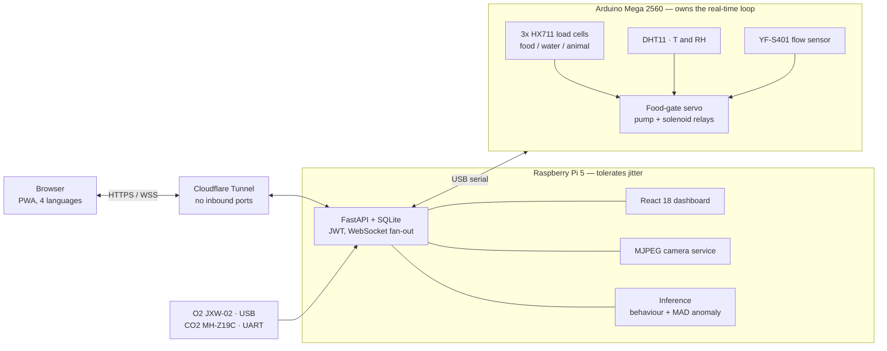

# Methods and detail

Long form detail moved out of the README.

### Closed-loop volumetric water dosing

Delivering an *exact* volume of water to a mouse is harder than running a pump
for N seconds, and getting it wrong corrupts the intake measurement the whole
experiment depends on.

- A **YF-S401 flow sensor** (7.5 pulses/mL) counts what is actually delivered,
  rather than assuming a flow rate.
- The pump **stops early and coasts**: water already in the pipe keeps moving
  after the pump cuts, so the controller subtracts the measured coast volume and
  lands on target instead of overshooting every dose.
- A **normally-closed solenoid valve** closes the instant the pump stops. Without
  it, gravity siphons the tank through the line and the "dose" silently continues
  after the controller thinks it finished.
- If flow stalls mid-dose, the pump **auto-cycles to recover** rather than
  reporting a completed dose that never arrived.

Each of those four is a failure mode that produces *plausible but wrong* data,
which is the worst kind in an experiment.

## Architecture

The Mega owns anything with a deadline; the Pi owns anything that can wait. Load-cell
calibration lives in the Mega's EEPROM so it survives a power cycle, and the dosing
loop keeps running if the Pi reboots mid-experiment.

| layer | stack |
|---|---|
| firmware | Arduino Mega 2560 (C++), inline sensor protocols, EEPROM calibration |
| backend | FastAPI, SQLAlchemy, SQLite, JWT, WebSockets |
| frontend | React 18 + TypeScript + Vite, PWA, 4-language i18n |
| inference | scikit-learn (behaviour), MAD-based streaming anomaly detector |
| ops | Cloudflare Tunnel, systemd timers, pull-only auto-deploy, GitHub Actions |

Exports run to CSV, JSON, XLSX, PDF and DOCX, streamed and row-capped, so a
researcher can pull a range straight into R or SPSS.

---

## Attribution

A three-person team over one semester. Commit counts from the original
repository, which is the fairest evidence available:

| contributor | commits | principal area |
|---|---:|---|
| **Aghasalim Mustafazada** (this account) | 173 | backend, dashboard, device/firmware, deployment, docs |
| **Gražvydas Stalmokas** | 29 | behaviour-classification models, multi-animal tracking |
| **Hadi Hleihel** | 2 |, |

Concretely: I wrote the FastAPI backend and its tests, the React dashboard, the
Arduino firmware and the Pi-side device services, the camera service, the
Cloudflare Tunnel and pull-only deploy pipeline, and the documentation. The
model-training code under`ai/training/`, the behaviour classifiers and the
YOLO multi-animal tracking, is principally Gražvydas's work; my contribution
there was the real-time inference integration that runs it in the live loop
(`ai/inference/`) and the serving path in`backend/app/ai/`.

---
